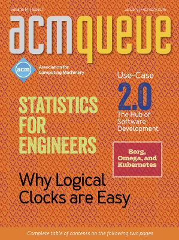

# Statistics for Engineers

Shoutout: This work was made possibly by [Circonus](circonus.com) -- the monitoring system with full histogram support.

## Abstract

Gathering all kinds of telemetry data is key to operating reliable distributed systems at scale. Once you have set-up your monitoring systems and recorded all relevant data, the challenge becomes to make sense of it and extract valuable information, like:

* Are we fulfilling our SLA?
* How did our query response times change with the last update?

Statistics is the art of extracting information from data. In this tutorial, we address the basic statistical knowledge that helps you at your daily work as a system operator. We will cover probabilistic models, summarizing distributions with mean values, quantiles, and histograms and their relations. Also advanced topics like time series forecasting and scalability analysis will be touched.

The tutorial focuses on practical aspects and will give you hands on knowledge of how to handle, import, analyze, and visualize telemetry data with UNIX command line tools, gnuplot, and the iPython toolkit.

## Selected Episodes

0. [Introduction](2015-10-28-Velocity-Amsterdam/Episode%200%20--%20Introduction.ipynb)
1. [Visualizing Data](2015-10-28-Velocity-Amsterdam/Episode%201%20--%20Visualizing%20Data.ipynb)
2. [Histograms](2015-10-28-Velocity-Amsterdam/Episode%202%20--%20Histograms.ipynb)
3. [Summary Statistics](2015-10-28-Velocity-Amsterdam/Episode%203%20--%20Summary%20Statistics.ipynb)
4. [Quantiles and Outliers](2015-10-28-Velocity-Amsterdam/Episode%204%20--%20Quantiles%20and%20Outliers.ipynb)
5. [Forecasting](2015-10-28-Velocity-Amsterdam/Episode%205%20--%20Forecasting.ipynb)
6. [Queuing Theory](2017-10-17-Velocity-London/S8%20-%20Math%20V%20-%20Queuing%20Theory.ipynb)

## Boostrap

If you have access to a machine with docker installed, you can boostrap
an interactive working environment with a single command:

```
$ ./docker.sh
[...]
#
# Data Science 4 Effective Operations
#
# starting jupyter notebook&lab ...
done
#
# Notebook:
# * local url: http://0.0.0.0:9999/?token=F2AlHtJBvHIqoLFEVfbMnUVFkcpFlJuZ
# * public url: http://11.22.33.192:9999/?token=F2AlHtJBvHIqoLFEVfbMnUVFkcpFlJuZ
#
# Lab:
# * local url: http://0.0.0.0:9998/?token=F2AlHtJBvHIqoLFEVfbMnUVFkcpFlJuZ
# * public url: http://11.22.33.192:9998/?token=F2AlHtJBvHIqoLFEVfbMnUVFkcpFlJuZ
```

## Events

This workshop has been held in at a number of events in slightly different forms.

* 2018-08-29 [SRECon18](https://www.usenix.org/conference/srecon18europe), Düsseldorf, Germany
* 2016-06-12 [SRECon16](https://srecon16europe.sched.org/event/7VkQ/statistics-for-engineers), Dublin, Ireland
* 2015-10-28 [Velocity](http://velocityconf.com/devops-web-performance-eu-2015/public/schedule/detail/45241), Amsterdam, Netherlands
* 2015-07-29 [StatsCraft](http://www.statscraft.org.il/), Tel-Aviv, Israel
* 2015-05-14 [SRECon15](https://www.usenix.org/conference/srecon15europe/program), Dublin, Ireland

See the corresponding subfolders for the presented content.

If you want to be informed about upcoming events consider watch out for the following hashtag on Twitter: [#StatsForEngineers](https://twitter.com/search?q=%23statsforengineers&src=typd)

### Monitorama, PDX 2016

* Event: 2016-06-29 [Monitorama](http://monitorama.com/2016/pdx.html), Portland USA

* Slides: https://www.slideshare.net/HeinrichHartmann/statistics-for-engineers-63589022?qid=f66fa7df-ddd5-48fb-ab5d-9e1ddbd2a162&v=&b=&from_search=3

* Video: https://vimeo.com/173610069

### CACM

A writeup of the material was published in print by the CACM and the ACM Queue magazine.

* ACM Queue 14/1: https://queue.acm.org/detail.cfm?id=2903468

* CACM Vol. 59 No. 7 (paywalled): https://cacm.acm.org/magazines/2016/7/204029-statistics-for-engineers/abstract




## Further Reading

* Statistics
  - Rice - Mathematical Statistics and Data Analysis (advanced)

* Tools
  - McKinney - Python for Data Anlaysis  
  - Janert - Data Analysis with Open Source tools  
  - Janssens - Data Science at the Command Line (O'Reilly 2015)  

* Queuing Theory
  - [VividCortex - The Essential Guide to Queueing Theory](https://www.vividcortex.com/resources/queueing-theory)
  - [VividCortex - Practical Scalability Analysis with the Universal Scalability Law](https://www.vividcortex.com/resources/universal-scalability-law/)

## Datasets

* [dc1cpu.csv](datasets/dc1cpu.csv) - CPU utilization of a machine cluster

* [LogDB.out](datasets/LogDB.out) - DB log file

* [LogDB.csv](datasets/LogDB.csv) - Parsed into CSV
  
* [API_latencies.csv](datasets/API_latencies.csv) - API latency for individual requests

* [ReqMultiNode.csv](datasets/ReqMultiNode.csv) - Request rates for a cluster of nodes

* [WebLatency.csv](datasets/WebLatency.csv) - Ping latencies for a server measured from different locations
